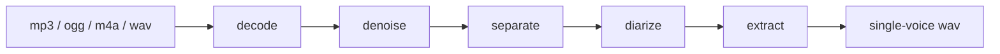

# keep-one-voice

Isolate the main voice from an audio recording by removing background noise,
music and secondary speakers.

> **Status: F2 complete.** `kov` decodes to mono 48 kHz, removes background
> noise with DeepFilterNet 3, and pulls the voice out of a mix with Demucs v4.
> Measured at **+11.8 to +13.5 dB** SI-SDR across every interference type in the
> corpus. `diarize` and `extract` are not implemented yet: they pass the audio
> through unchanged and say so on stderr. See
> [Measuring quality](#measuring-quality) — the F2 result is not the one anyone
> expected.

## The problem

Real recordings arrive dirty. Interviews pick up street noise, voice notes are
recorded next to an air conditioner, field captures have music underneath, and
meetings have three people talking over each other. Cleaning that up by hand
means learning an audio editor and spending an afternoon on a five-minute clip.

`kov` takes a file in and gives one clean voice back.

```bash
kov interview.mp3 -o interview.clean.wav
```

## How it works

The pipeline is a chain of independent stages. Each one can be run on its own,
which matters: audio quality is measured per stage, not at the end.



| Stage | What it does | Engine |
| ----- | ------------ | ------ |
| `decode` | Container to PCM mono 48 kHz | FFmpeg |
| `denoise` | Remove background noise | DeepFilterNet 3 |
| `separate` | Split voice from music and instruments | Demucs v4 (`htdemucs`) |
| `diarize` | Find who speaks when | pyannote 3.1 |
| `extract` | Keep only the target speaker | — |

Run a subset with `--stages`:

```bash
kov noisy-note.ogg --stages decode,denoise
```

### Choosing the speaker

By default `kov` keeps the **dominant** speaker: the one with the most total
speaking time, breaking ties by mean loudness.

This is a heuristic and it will be wrong sometimes — if the other person talks
longer or louder than the one you want, you get the wrong voice. Speaker
selection lives behind a port (`SpeakerSelector`), so explicit selection and
reference-sample matching can be added without touching the rest of the
pipeline.

## Architecture

Two runtimes, one explicit boundary between them.

```
packages/core     Domain. Ports, the pipeline contract, speaker selection.
                  Imports nothing from the CLI or the worker.
packages/cli      Adapter. Argument parsing, output, exit codes.
worker/           Python ML engine. Newline-delimited JSON over stdio.
```

TypeScript orchestrates; Python does the machine learning. That split is not a
preference — the source separation ecosystem (Demucs, pyannote, DeepFilterNet)
only exists in Python, while the CLI is far more pleasant to build and ship in
TypeScript.

The riskiest part of this codebase is the contract between the two, defined
twice: in [`packages/core/src/index.ts`](packages/core/src/index.ts) and in
[`worker/src/kov_worker/protocol.py`](worker/src/kov_worker/protocol.py).
Change one without the other and the pipeline breaks silently.

## Requirements

| Requirement | Why |
| ----------- | --- |
| [Bun](https://bun.sh) 1.3+ | Runtime and package manager for the CLI |
| [FFmpeg](https://ffmpeg.org) | Decoding `mp3`, `ogg`, `m4a`. Without it, only WAV works |
| Python 3.11+ and [uv](https://docs.astral.sh/uv/) | The ML worker |
| `HF_TOKEN` | Model weights from Hugging Face |

Diarization has an extra manual gate: `pyannote/speaker-diarization-3.1` is a
gated model. You must accept its licence on the model page and export a token
before that stage will run.

```bash
export HF_TOKEN=hf_...
```

## Development

```bash
bun install          # TypeScript dependencies
bun run setup:py     # Python worker environment (uv sync)
```

Model dependencies are optional and split per phase, so working on one stage
does not drag in the model stack of the others:

```bash
cd worker && uv sync --extra denoise      # F1: DeepFilterNet 3
cd worker && uv sync --extra separate     # F2: Demucs v4
```

Then:

```bash
bun run dev sample.mp3   # run the CLI from source
bun run test             # bun:test + pytest
bun run lint             # Biome + Ruff
bun run typecheck        # tsc --noEmit
bun run build            # compile the binary into dist/kov
```

## Measuring quality

"Sounds better" is not a criterion anyone can verify, so every claim about a
cleaning stage has to come from a number.

```bash
bun run fixtures   # build the corpus: 3 speakers x 3 noise types x 4 SNRs
bun run eval       # score it with SI-SDR
```

The corpus is synthesised locally — speech from `say`, noise from a seed, mixed
at exact SNRs — because SI-SDR needs a clean reference and a real-world
recording does not have one. It is reproducible from the seed, so it is
generated rather than committed.

It holds two kinds of material: 48 single-voice mixtures against white, brown,
mains hum and music, and 5 multi-speaker conversations for F3. Each conversation
ships every speaker's own contribution to the timeline, the turn boundaries, and
**two** answers to "which voice do we keep" — the one the automatic heuristic
will choose, and the one a person actually wants.

Two of the five scenarios are built so those disagree, because the dominant
speaker heuristic is documented as failing when the other person talks longer or
louder. `bun run eval` prints which scenarios it aims at the wrong voice in:

```
two-hard-duration    en-female   en-male      NO     +3.12
two-hard-loudness    en-female   en-male      NO     -0.18
```

That failure is measured rather than discovered by a user.

Run `kov` over `fixtures/generated/noisy/`, then score the output:

```bash
bun run eval --processed <output-dir>
```

### F1 results

Baseline is +8.75 dB SI-SDR with no cleaning. DeepFilterNet 3 over the whole
corpus:

| Noise | Mean gain |
| ----- | --------- |
| white (hiss, fans) | **+12.01 dB** |
| hum (50 Hz mains) | **+10.69 dB** |
| brown (traffic, air conditioning) | **+4.07 dB** |

The gain is largest where the noise is worst, which is what a denoiser should
do: +15 dB at 0 dB SNR, around +7 dB at 20 dB SNR.

### F2 results, and a surprise

Both pipelines were run over the same 48 files, 48 of 48 processed, 0 failures:

| Interference | denoise only | denoise + separate | Effect of F2 |
| ------------ | ------------ | ------------------ | ------------ |
| music | +8.38 dB | +8.44 dB | **+0.06** |
| brown | +4.07 dB | **+11.21 dB** | **+7.14** |
| hum | +10.69 dB | **+13.49 dB** | **+2.80** |
| white | +12.01 dB | +11.76 dB | −0.25 |

**F2 does almost nothing for the job it was built for, and solves a problem it
was not aimed at.** Adding Demucs gains 0.06 dB on music. It gains 7.14 dB on
low-frequency noise — which is precisely where F1 was documented as weak.

The mechanism fits: `htdemucs` has a dedicated `bass` stem, so it routes
low-frequency energy away from `vocals`. DeepFilterNet has no such structure and
cannot separate a low rumble from a low voice.

The male voice, which gained nothing from F1 against brown noise, is recovered:

| Speaker | brown, F1 only | brown, F1 + F2 |
| ------- | -------------- | -------------- |
| en-female | +10.0 dB | +14.4 dB |
| es-female | +1.8 dB | +10.7 dB |
| **en-male** | **+0.4 dB** | **+8.5 dB** |

**Do not read this as "Demucs is useless on music."** The corpus uses a
synthesised chord loop, which is periodic and tonal — probably far easier for
DeepFilterNet to remove than a real recording. The honest conclusion is that our
music proxy is too easy to separate the two models, not that F2 has no value on
real music. Confirming that needs licensed real music, which is out of scope for
a corpus that ships in a public repository.

## Roadmap

Built in layers. Each phase ships and is measured before the next one starts —
debugging a four-stage pipeline all at once is not a plan.

- [x] **F0** — Decode, spawn the worker, round-trip the protocol
- [x] **F1** — Denoise a single voice against background noise
- [x] **F2** — Separate voice from music and instruments
- [ ] **F3** — Diarize and extract the dominant speaker
- [ ] **F4** — Optional transcription of the result

Quality is judged with metrics (SI-SDR, PESQ) against a fixture corpus, not by
ear. "Sounds better" is not a criterion anyone can verify.

## Contributing

Read [`CLAUDE.md`](CLAUDE.md) first — it holds the project conventions, the
architecture rules and the working agreement.

The short version:

- Conventional Commits, in English, imperative, 72 characters maximum.
- Work branches off `dev`. `master` only receives pull requests from `dev`.
- Tests come first. Behaviour, not implementation details.
- Never commit model weights or large audio files.

## Privacy

`kov` runs entirely on your machine. Audio is never uploaded anywhere. The only
network access is downloading model weights from Hugging Face the first time a
stage needs them.

## Licence

[MIT](LICENSE) © Manuel Fajardo
