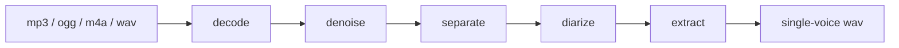

# keep-one-voice

Isolate the main voice from an audio recording by removing background noise,
music and secondary speakers.

> **Status: early scaffold.** The architecture, contracts and tooling are in
> place and tested, but no audio processing stage is implemented yet. Running
> `kov` today exits with `not implemented`. See [Roadmap](#roadmap) for what
> works and what does not.

## The problem

Real recordings arrive dirty. Interviews pick up street noise, voice notes are
recorded next to an air conditioner, field captures have music underneath, and
meetings have three people talking over each other. Cleaning that up by hand
means learning an audio editor and spending an afternoon on a five-minute clip.

`kov` takes a file in and gives one clean voice back.

```bash
kov interview.mp3 -o interview.clean.wav
```

## How it works

The pipeline is a chain of independent stages. Each one can be run on its own,
which matters: audio quality is measured per stage, not at the end.



| Stage | What it does | Engine |
| ----- | ------------ | ------ |
| `decode` | Container to PCM mono 16 kHz | FFmpeg |
| `denoise` | Remove background noise | DeepFilterNet |
| `separate` | Split voice from music and instruments | Demucs v4 |
| `diarize` | Find who speaks when | pyannote 3.1 |
| `extract` | Keep only the target speaker | — |

Run a subset with `--stages`:

```bash
kov noisy-note.ogg --stages decode,denoise
```

### Choosing the speaker

By default `kov` keeps the **dominant** speaker: the one with the most total
speaking time, breaking ties by mean loudness.

This is a heuristic and it will be wrong sometimes — if the other person talks
longer or louder than the one you want, you get the wrong voice. Speaker
selection lives behind a port (`SpeakerSelector`), so explicit selection and
reference-sample matching can be added without touching the rest of the
pipeline.

## Architecture

Two runtimes, one explicit boundary between them.

```
packages/core     Domain. Ports, the pipeline contract, speaker selection.
                  Imports nothing from the CLI or the worker.
packages/cli      Adapter. Argument parsing, output, exit codes.
worker/           Python ML engine. Newline-delimited JSON over stdio.
```

TypeScript orchestrates; Python does the machine learning. That split is not a
preference — the source separation ecosystem (Demucs, pyannote, DeepFilterNet)
only exists in Python, while the CLI is far more pleasant to build and ship in
TypeScript.

The riskiest part of this codebase is the contract between the two, defined
twice: in [`packages/core/src/index.ts`](packages/core/src/index.ts) and in
[`worker/src/kov_worker/protocol.py`](worker/src/kov_worker/protocol.py).
Change one without the other and the pipeline breaks silently.

## Requirements

| Requirement | Why |
| ----------- | --- |
| [Bun](https://bun.sh) 1.3+ | Runtime and package manager for the CLI |
| [FFmpeg](https://ffmpeg.org) | Decoding `mp3`, `ogg`, `m4a`. Without it, only WAV works |
| Python 3.11+ and [uv](https://docs.astral.sh/uv/) | The ML worker |
| `HF_TOKEN` | Model weights from Hugging Face |

Diarization has an extra manual gate: `pyannote/speaker-diarization-3.1` is a
gated model. You must accept its licence on the model page and export a token
before that stage will run.

```bash
export HF_TOKEN=hf_...
```

## Development

```bash
bun install          # TypeScript dependencies
bun run setup:py     # Python worker environment (uv sync)
```

The heavy model dependencies are optional so the scaffold installs in seconds.
Pull them in when you start working on a model stage:

```bash
cd worker && uv sync --extra ml
```

Then:

```bash
bun run dev sample.mp3   # run the CLI from source
bun run test             # bun:test + pytest
bun run lint             # Biome + Ruff
bun run typecheck        # tsc --noEmit
bun run build            # compile the binary into dist/kov
```

## Roadmap

Built in layers. Each phase ships and is measured before the next one starts —
debugging a four-stage pipeline all at once is not a plan.

- [ ] **F0** — Decode, spawn the worker, round-trip the protocol
- [ ] **F1** — Denoise a single voice against background noise
- [ ] **F2** — Separate voice from music and instruments
- [ ] **F3** — Diarize and extract the dominant speaker
- [ ] **F4** — Optional transcription of the result

Quality is judged with metrics (SI-SDR, PESQ) against a fixture corpus, not by
ear. "Sounds better" is not a criterion anyone can verify.

## Contributing

Read [`CLAUDE.md`](CLAUDE.md) first — it holds the project conventions, the
architecture rules and the working agreement.

The short version:

- Conventional Commits, in English, imperative, 72 characters maximum.
- Work branches off `dev`. `master` only receives pull requests from `dev`.
- Tests come first. Behaviour, not implementation details.
- Never commit model weights or large audio files.

## Privacy

`kov` runs entirely on your machine. Audio is never uploaded anywhere. The only
network access is downloading model weights from Hugging Face the first time a
stage needs them.

## Licence

[MIT](LICENSE) © Manuel Fajardo
